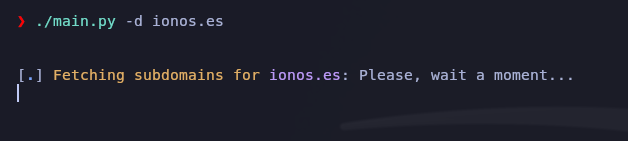
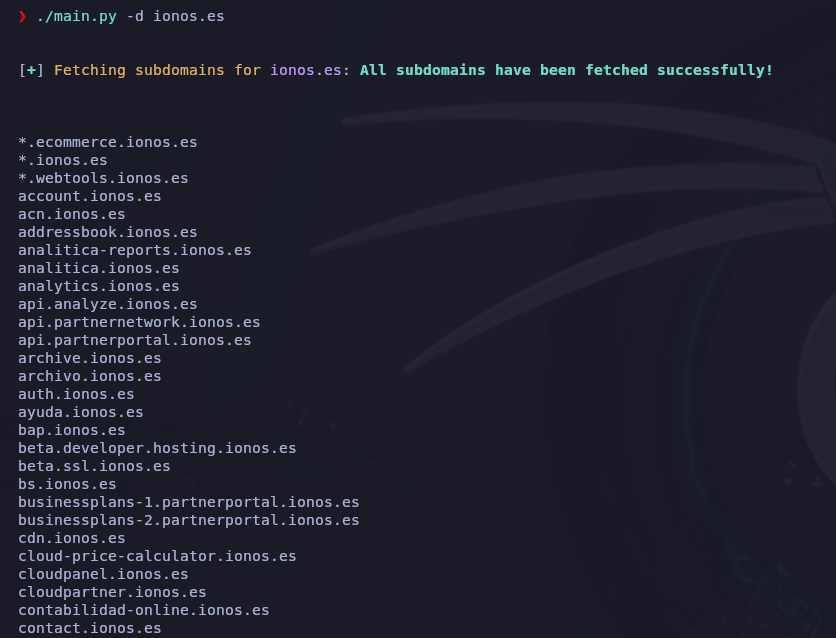
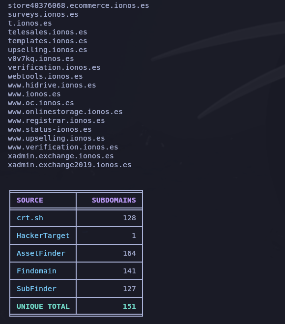

# DNS-Scan

DNS-Scan is a tool to discover subdomains passively using various APIs and tools.





-----------------------
> **PyPI project link:** https://pypi.org/project/dns-scan/
-----------------------
## Installation

```bash
sudo apt-get update && sudo apt install -y python3-pip curl findomain assetfinder subfinder

pip install dns-scan
```

## Usage

```bash
dns-scan -h
```
```
usage: dns-scan [-h] -d DOMAIN [-o OUTPUT]

Get all subdomains of a domain passively using various tools and APIs.

options:
  -h, --help           show this help message and exit
  -d, --domain DOMAIN  Domain to analyze
  -o, --output OUTPUT  Output file to save the subdomains
```

```bash
dns-scan -d example.com
```

```bash
dns-scan -d example.com -o output.txt
```
